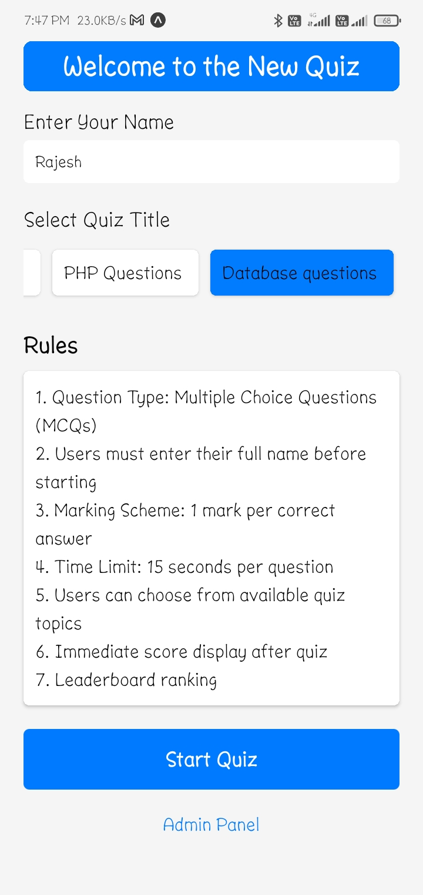

# Quiz App

This is a React Native Quiz App that provides users with multiple-choice aptitude tests. The app is designed to allow users to take quizzes, view results, and improve their knowledge on various topics.

## Features

- **Multiple Quizzes**: The app includes different sets of questions on various topics.
- **Timer**: A countdown timer for each quiz to add a challenge element.
- **User Results**: Displays the final score and correct answers after completing a quiz.
- **Responsive Design**: The app is fully responsive and works on both iOS and Android devices.
- **Navigation**: Smooth navigation between quiz sections using React Navigation.

## Functionality

1. **Home Screen**:
   - Displays a welcome message and options to start a quiz.
   - Option to select different quiz categories.

2. **Quiz Screen**:
   - A question is displayed with multiple-choice answers.
   - A timer counts down the time remaining.
   - Users can select an answer and proceed to the next question.
   - The app displays feedback (correct/incorrect) after the user selects an answer.

3. **Results Screen**:
   - After completing the quiz, users see their score.
   - The results include the total number of correct answers and the incorrect ones.
   - Option to retake the quiz or go back to the home screen.

4. **Navigation**:
   - Simple and intuitive navigation throughout the app with React Navigation.

## Screenshots

Below are the screenshots of different screens in the app:




## Video Demonstration

Here is a video demonstration of the app:


### Prerequisites
Make sure you have the following installed:

- Node.js (v14 or later)
- React Native CLI
- Expo CLI (if using Expo)
- Android Studio or Xcode (for Android/iOS emulation)

### Install dependencies:

1. Clone the repository:
   ```bash
   git clone https://github.com/your-username/quiz-app.git
   cd quiz-app
